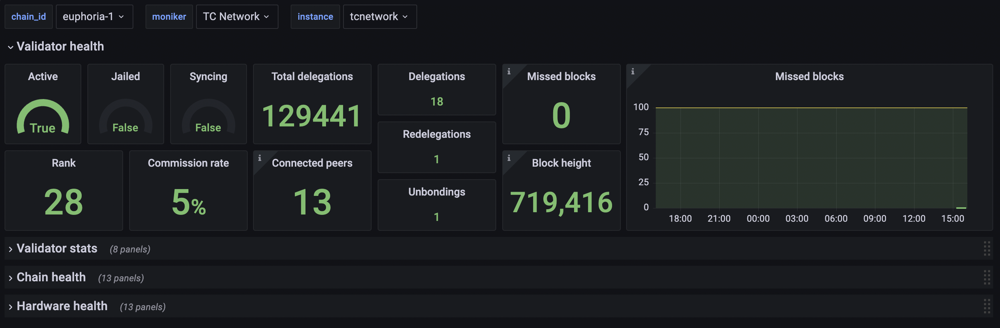
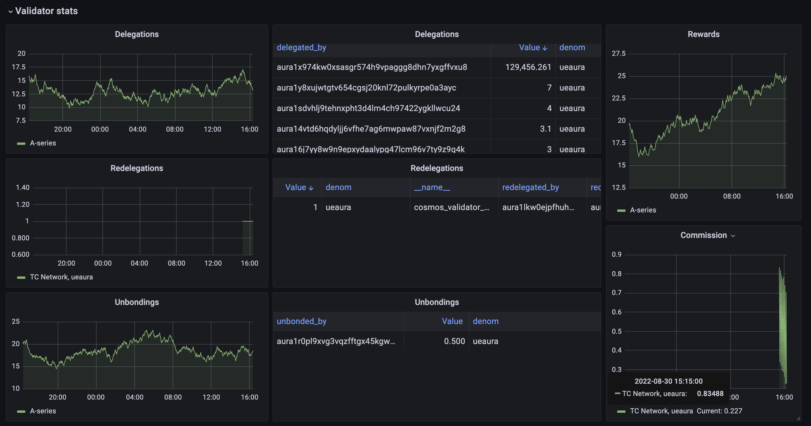
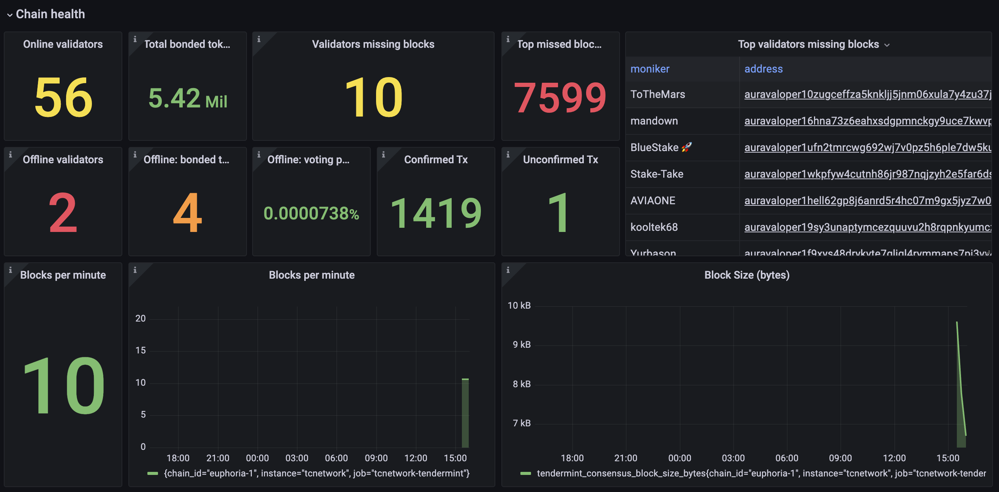
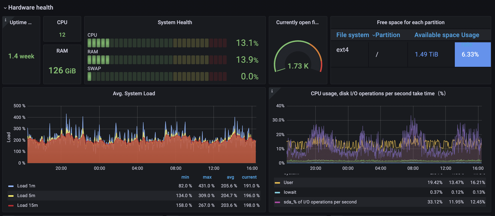

# Cosmos Node Monitoring & Alerting

Instructions of how to setup node exporters on validator; setup prometheus, grafana, alertmanager on monitoring site. And also provides shell scripts with 'one click' setting.

This instruction will assume an amd64-based device running Linux is used.

## Overview

### 1. On Validator server

- Enable Prometheus setting
- Install Node Exporter
- Install Cosmos Exporter

### 2. On Web server

- Install Prometheus
- Install Alert Manager
- Install Grafana (if not using Grafana Cloud)

### 3. On Grafana Cloud

- Create Grafana account
- Create Grafana Cloud API key
- Include Grafana Cloud username and the API key to Prometheus

## Installation Steps

### Step 1. Enable Prometheus setting

Edit the `config.toml` file on node and enable Prometheus. The default metrics port will be `26660`.

### Step 2. Install Node Exporter

#### 2.1. Download binary

```sh
wget https://github.com/prometheus/node_exporter/releases/download/v1.3.1/node_exporter-1.3.1.linux-amd64.tar.gz
tar xvfz node_exporter-*.*-amd64.tar.gz
sudo mv node_exporter-*.*-amd64/node_exporter /usr/local/bin/
rm node_exporter-* -rf
```

#### 2.2. Create new user

```sh
sudo useradd -rs /bin/false node_exporter
```

#### 2.3. Create a systemd service

Using one of these commands to create a new service ```nano```, ```cat``` or ```tee```. Following use with ```nano```.

```sh
sudo touch /etc/systemd/system/node-exporter.service && sudo nano /etc/systemd/system/node-exporter.service
```

And use this template

```sh
[Unit]
Description=Node Exporter
After=network.target

[Service]
User=node_exporter
Group=node_exporter
Type=simple
ExecStart=/usr/local/bin/node_exporter

[Install]
WantedBy=multi-user.target
```

#### 2.4. Start a systemd service

```sh
sudo systemctl daemon-reload
sudo systemctl enable node-exporter
sudo systemctl start node-exporter
```

#### 2.5. Verify that metrics are being exported on port 9100

```sh
curl http://localhost:9100/metrics
```

### Step 3. Install Cosmos Exporter

#### 3.1. Download latest version from the [releases page](https://github.com/solarlabsteam/cosmos-exporter/releases/)

```sh
wget https://github.com/solarlabsteam/cosmos-exporter/releases/download/v0.3.0/cosmos-exporter_0.3.0_Linux_x86_64.tar.gz
tar xvfz cosmos-exporter_*.*_Linux_x86_64.tar.gz
sudo cp ./cosmos-exporter /usr/bin
rm cosmos-exporter_* -rf
```

#### 3.2. Create new user

```sh
sudo useradd -rs /bin/false cosmos_exporter
```

#### 3.3. Create a systemd service

Using one of these commands to create a new service ```nano```, ```cat``` or ```tee```. Following use with ```nano```.

```sh
sudo touch /etc/systemd/system/cosmos-exporter.service && sudo nano /etc/systemd/system/cosmos-exporter.service
```

And use this template

```sh
[Unit]
Description=Cosmos Exporter
After=network-online.target

[Service]
User=cosmos_exporter
Group=cosmos_exporter
TimeoutStartSec=0
CPUWeight=95
IOWeight=95
ExecStart=cosmos-exporter --denom $BOND_DENOM --denom-coefficient 1000000 --bech-prefix $BENCH_PREFIX
Restart=always
RestartSec=2
LimitNOFILE=800000
KillSignal=SIGTERM

[Install]
WantedBy=multi-user.target
EOF
```

Set value for the `denom` and `prefix` parameters. Example for Cosmos Hub

```sh
$BOND_DENOM=uatom
$BENCH_PREFIX=cosmos
```

#### 3.4. Start a systemd service

```sh
sudo systemctl daemon-reload
sudo systemctl enable cosmos-exporter
sudo systemctl start cosmos-exporter
```

#### 3.5. Check the logs of the process, default port is 9300

```sh
sudo journalctl -u cosmos-exporter -f --output cat
```

_**Note**: Cosmos Exporter work on a Cosmos-based blockchains with cosmos-sdk >= 0.40.0_

### Step 4. Install Prometheus

#### 4.1. Download latest version from the [releases page](https://github.com/prometheus/prometheus/releases)

```sh
wget https://github.com/prometheus/prometheus/releases/download/v2.34.0/prometheus-2.34.0.linux-amd64.tar.gz
tar xvfz prometheus-*.*-amd64.tar.gz
sudo mv prometheus-*.*-amd64 prometheus
rm prometheus-* -rf
```

#### 4.2. Configure Prometheus

Open config file `/prometheus/prometheus.yml`.

```sh
sudo nano ~/prometheus/prometheus.yml
```

And add Node Exporter and Cosmos Exporter into the section `scrape_configs`. Here is example setting for `Cosmos Hub`.

```sh
# default Prometheus metrics
- job_name: tendermint
  static_configs:
  - targets: ['VALIDATOR_IP:26660']
    labels:
      instance: atom

# node-exporter
- job_name: node
  static_configs:
  - targets: ['VALIDATOR_IP:9100']
    labels:
      instance: atom

# cosmos-exporter - all validators
- job_name: validators
  scrape_interval: 15s
  metrics_path: /metrics/validators
  static_configs:
  - targets: ['VALIDATOR_IP:9300']
    labels:
      instance: atom

# cosmos-exporter - specific validator(s)
- job_name: validator
  scrape_interval: 15s
  metrics_path: /metrics/validator
  static_configs:
    - targets:
      - VALOPER_ADDRESS
  relabel_configs:
    - source_labels: [__address__]
      target_label: __param_address
    - source_labels: [__param_address]
      target_label: instance
    - target_label: __address__
      replacement: VALIDATOR_IP:9300
```

#### 4.3. Create a systemd service

```sh
sudo tee <<EOF >/dev/null /etc/systemd/system/prometheus.service
[Unit]
Description=Prometheus
After=network-online.target

[Service]
User=$USER
ExecStart=$HOME/prometheus/prometheus --config.file=$HOME/prometheus/prometheus.yml
Restart=always
RestartSec=3
LimitNOFILE=4096

[Install]
WantedBy=multi-user.target
EOF
```

#### 4.4. Start a systemd service

```sh
sudo systemctl daemon-reload
sudo systemctl enable prometheus
sudo systemctl start prometheus
```

_**Note**: Default port is 9090. In order to use other port (ex: 6666), add paramter --web.listen-address=:6666 to the service file._

### Step 5. Install Alert Manager

#### 5.1. Visit the [download page](https://github.com/metalmatze/alertmanager) and grab the download link

```sh
wget https://github.com/prometheus/alertmanager/releases/download/v0.24.0/alertmanager-0.24.0.linux-amd64.tar.gz
tar xvfz alertmanager-0.24.0.linux-amd64.tar.gz
rm alertmanager-0.24.0.linux-amd64.tar.gz
```

#### 5.2. Configuration

```sh
cd alertmanager-0.24.0.linux-amd64

# create folders to save data and config file
sudo mkdir -p /etc/alertmanager
sudo mkdir -p /data/alertmanager

# move config file to config folder
sudo mv alertmanager.yml /etc/alertmanager

# move the executables to the /usr/local/bin folder
sudo mv amtool alertmanager /usr/local/bin
```

#### 5.3. Create new user

```sh
sudo useradd -rs /bin/false alertmanager
sudo chown alertmanager:alertmanager /usr/local/bin/amtool /usr/local/bin/alertmanager
sudo chown -R alertmanager:alertmanager /data/alertmanager /etc/alertmanager/*
```

#### 5.4. Create a systemd service

```sh
sudo tee <<EOF >/dev/null /etc/systemd/system/alertmanager.service
[Unit]
Description=Alert Manager
After=network-online.target

[Service]
Type=simple
User=alertmanager
Group=alertmanager
ExecStart=/usr/local/bin/alertmanager --config.file=/etc/alertmanager/alertmanager.yml --storage.path=/data/alertmanager
Restart=always

[Install]
WantedBy=multi-user.target
EOF
```

#### 5.5. Start a systemd service

```sh
sudo systemctl daemon-reload
sudo systemctl enable alertmanager
sudo systemctl start alertmanager
```

#### 5.6. Check the logs of the process, default port is 9093

```sh
sudo journalctl -u alertmanager -f --output cat
curl http://localhost:9093/alerts
```

#### 5.7. Update Prometheus Config file

Open config file `/prometheus/prometheus.yml` and update `alerting` and `rule_files` section.

```sh
alerting:
  alertmanagers:
  - static_configs:
    - targets:
      - localhost:9093

rule_files:
  - /path-to-alert.rules
```

In order to alert to Telegram, update the `/etc/alertmanager/alertmanager.yml`:

```sh
sudo nano /etc/alertmanager/alertmanager.yml

route:
  group_by: ['alertname']
  group_wait: 30s
  group_interval: 5m
  repeat_interval: 1h
  receiver: 'telegram'

receivers:
  - name: 'telegram'
    telegram_configs:
    - api_url: 'https://api.telegram.org'
      bot_token: 'telegram bot token'
      chat_id: 'ID of the chat where to send the messages'
      parse_mode: 'HTML'

inhibit_rules:
  - source_match:
      severity: 'critical'
    target_match:
      severity: 'warning'
    equal: ['alertname']

```

#### 5.8. Restart prometheus service to apply new configuration

```sh
sudo systemctl restart alertmanager
sudo systemctl restart prometheus

sudo journalctl -u alertmanager -f --output cat
sudo journalctl -u prometheus -f --output cat
```

### Step 6. Install Grafana (if not using Grafana Cloud)

#### 6.1. Visit the [download page](https://grafana.com/grafana/download) and grab the download link

```sh
sudo apt-get install -y adduser libfontconfig
wget https://dl.grafana.com/enterprise/release/grafana-enterprise_9.4.7_amd64.deb
sudo dpkg -i grafana-enterprise_9.4.7_amd64.deb
```

#### 6.2. Start Grafana Server As a Service

```sh
sudo systemctl daemon-reload
sudo systemctl enable grafana-server
sudo systemctl start grafana-server
sudo systemctl status grafana-server
sudo journalctl -u grafana-server -f -o cat
```

#### 6.3. Setting Grafana

By default Grafana will running on port `3000` after install, customize following settings to improve security:

A. Setting Up the Reverse Proxy

```sh
sudo nano /etc/nginx/conf.d/your_domain.conf
```

```nginx
map $http_upgrade $connection_upgrade {
 default upgrade;
 '' close;
}

server {
  listen 80;
  listen [::]:80; 

  server_name your_domain www.your_domain;

  location / {
    proxy_set_header Host $http_host;
    proxy_pass http://localhost:3000;
  }

  location /api/live {
    proxy_http_version 1.1;
    proxy_set_header Upgrade $http_upgrade;
    proxy_set_header Connection $connection_upgrade;
    proxy_set_header Host $http_host;
    proxy_pass http://localhost:3000;
  }
}
```

```sh
sudo nginx -t
sudo systemctl reload nginx
```

B. Disabling Grafana Registrations and Anonymous Access

```sh
sudo nano /etc/grafana/grafana.ini
```

```ini
[server]
http_port = 'your custom port'

[users]
# disable user signup / registration
allow_sign_up = false

[auth.anonymous]
# enable anonymous access
enabled = false
```

Restart Granfana service

```sh
sudo systemctl restart grafana-server
sudo systemctl status grafana-server
```

### Step 7. Using Grafana Cloud

#### 7.1. Create Grafana account

#### 7.2. Create Grafana Cloud API key

#### 7.3. Include Grafana Cloud username and the API key to Prometheus

- Navigate to the Cloud Portal, then from the Prometheus box, click Send Metrics.
- Generate Prometheus `remote_write` Configuration:

  ```json
  remote_write:
    - url: "<Your Metrics instance remote_write endpoint>"
      basic_auth:
        username: "your grafana username"
        password: "your Grafana API key"
  ```

- Add `remote_write` configuration to `/prometheus/prometheus.yml` file.

_**Note**: Make sure ports are opened_

- 9100 (Node Exporter)
- 9300 (Cosmos Exporter)
- 6666 (Prometheus)
- 9093 (Alert Manager)

### Demo

Here is the dashboard screen after setting all done.

- Dashboard


- Vaidator Stats


- Chain health


- Hardware health

